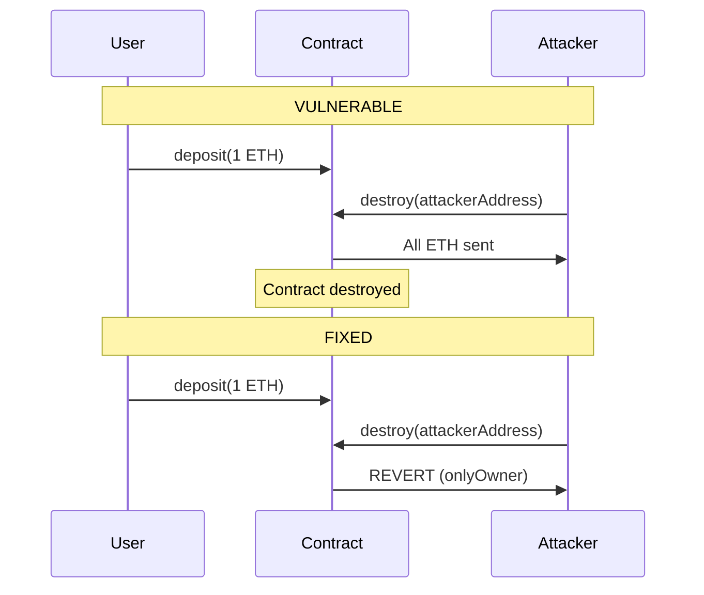
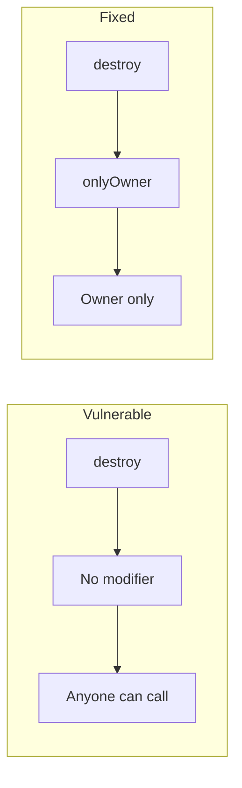

# SWC-106 Mermaid Diagrams

Use these in Mermaid-compatible tools (GitHub, Notion, etc.) or [mermaid.live](https://mermaid.live).

## Attack Flow (Vulnerable)

```mermaid
flowchart TB
    subgraph Vulnerable["⚠️ VULNERABLE - SWC-106"]
        User[User] -->|deposit ETH| Contract[Contract holds ETH]
        Attacker[Attacker] -->|destroy(attacker) NO CHECK| Contract
        Contract -->|selfdestruct| Attacker
        Attacker -->|Receives ALL ETH| Stolen[💰 ETH Stolen]
    end
```

## Secure Flow (Fixed)

```mermaid
flowchart TB
    subgraph Fixed["✅ FIXED - SWC-106 Remediated"]
        User[User] -->|deposit ETH| Contract[Contract holds ETH]
        Owner[Owner] -->|destroy(owner) onlyOwner ✓| Contract
        Contract -->|selfdestruct| Owner
        Attacker[Attacker] -->|destroy() attempt| Blocked[REVERT - Access Denied]
    end
```

## Sequence: Vulnerable vs Fixed



## Component: Access Control


